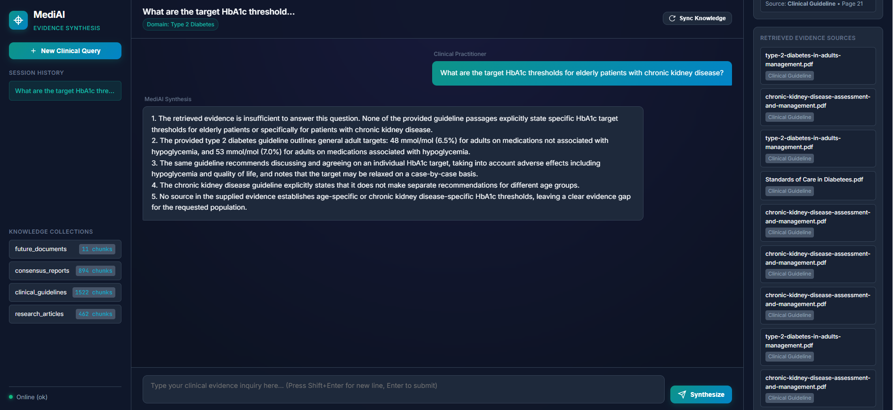

# MedEvidence AI

Production-inspired Multi-Agent Clinical Evidence Synthesis Platform built with **LangGraph**, **Retrieval-Augmented Generation (RAG)**, **Live PubMed Search**, **ChromaDB**, **Redis Memory**, and **LangSmith Observability**.

🎬 **[Demo](https://vimeo.com/1216906296?fl=ip&fe=ec)**

MedEvidence AI is an intelligent medical AI assistant designed to help clinicians and healthcare professionals quickly synthesize evidence-based clinical insights. While pre-configured for **Type 2 Diabetes** management, the underlying architecture is designed to be extensible to other clinical domains. It can be easily extended to any clinical domain (e.g., Cardiology, Oncology, Neurology) simply by adding guideline PDFs to the knowledge base. 

> Evidence synthesis system for healthcare professionals, designed to retrieve, compare, and summarize clinical evidence from guidelines and PubMed.

---

## 🎨 User Interface & Evidence Inspector

The platform features a modern dark-mode web application with a real-time execution timeline and an interactive Evidence Inspector panel.


---

## 🏗️ Multi-Agent Architecture & Graph Nodes

The core workflow is orchestrated using **LangGraph** as a cyclic `StateGraph`. The system cleanly separates **5 LLM-powered reasoning agents** (`app/agents/`) from **4 deterministic tools and processing nodes** (`app/nodes/`).

```
                         User Query
                             │
                             ▼
                    [Guardrail Agent] ──blocked──► Safety Response
                             │
                             ▼
                    [Memory Node (load)] ← Redis
                             │
                             ▼
                    [Planner Agent] (intent classification + routing)
                             │
               ┌──────────────┴──────────────┐ (parallel fan-out)
               ▼                             ▼
    [Clinical Guideline RAG]          [PubMed Node]
            (Chroma)                   (NCBI Entrez)
               │                             │
               └──────────────┬──────────────┘
                             │
                             ▼
                [Evidence Ranking Node] (Deterministic classification & metrics)
                             │
                             ▼
                [Clinical Reasoning Agent]
                             │
                             ▼
                   [Reflection Agent] ──retry──► Loop back (max 2)
                             │
                             ▼
               [Clinical Summary Agent]
                             │
                             ▼
                    [Memory Node (save)] → Redis
                             │
                             ▼
                  Clean Response & Citations
```

---

## 🤖 System Components (Agents & Deterministic Nodes)

### 🧠 Autonomous LLM Agents (`app/agents/`)
| Agent | Type | Responsibility |
|---|---|---|
| **Guardrail Agent** | LLM Agent | Detects unsafe, diagnostic, emergency, or prompt-injection requests and blocks them before entering the workflow. |
| **Planner Agent** | LLM Agent | Analyzes the clinical query, selects target collections, and determines retrieval routing strategies. |
| **Clinical Reasoning Agent** | LLM Agent | Interprets and Compares classified evidence, identifies consensus and conflicts, while remaining strictly grounded in the provided evidence. |
| **Reflection Agent** | LLM Agent | Evaluates evidence sufficiency. If evidence is sparse or conflicting, triggers a retrieval retry cycle (maximum two iterations). |
| **Clinical Summary Agent** | LLM Agent | Generates the final clean natural-language response, structured citations (page numbers, PMIDs, DOIs), and follow-up questions. |

### ⚡ Deterministic Nodes & Tool FHandlers (`app/nodes/`)
| Node / Module | Type | Responsibility |
|---|---|---|
| **Memory Node** | Tool / Redis | Loads and stores conversation history, tracked clinical topics, and evidence references using Redis without LLM overhead. |
| **Clinical Guideline RAG Node** | Tool / ChromaDB | Performs vector similarity search against local Chroma collections with exact page attribution. |
| **PubMed Node** | Tool / NCBI API | Queries NCBI Entrez REST API for biomedical literature, applies keyword filtering, and fetches article metadata. |
| **Evidence Ranking Node** | Deterministic Module | Deterministically classifies study types (Guideline, RCT, Meta-Analysis, Observational) and calculates objective metrics via metadata rules. |

---

## 🔬 PubMed Search Tool Architecture

The PubMed integration uses a clean tool abstraction layer (`BasePubMedTool`), allowing seamless swapping between NCBI Entrez (`EntrezPubMedTool`) and Model Context Protocol (`MCPPubMedTool`):

```
                         PubMed Agent
                              │
                              ▼
                  AbstractPubMedTool (Base)
                              │
                  ┌───────────┴────────────┐
                  │                        │
                  ▼                        ▼
         EntrezPubMedTool          MCPPubMedTool
             (Today)                  (Future)
```


---

## 🔁 Reflection & Self-Correction Loop

When retrieved evidence is sparse or insufficient, the **Reflection Agent** triggers an automated retry loop to expand search queries up to 2 times before generating the final answer.


---

## 💾 Redis Session Memory

Persists session context across multi-turn clinical conversations, allowing clinicians to ask follow-up questions seamlessly while maintaining evidence tracking.


---

## ⚡ Performance Optimization: Groq vs. Ollama

While local models via Ollama are supported for offline privacy, **inference latency is dramatically better with Groq** (`llama-3.3-70b-versatile`). It significantly reduced LLM inference latency compared with the local Ollama setup, making the multi-agent system much more responsive.

To use Groq, configure your `.env`:

```env
LLM_PROVIDER=groq
LLM_MODEL=llama-3.3-70b-versatile
GROQ_API_KEY=your_groq_api_key
```

---

## 📊 LangSmith Observability

Full end-to-end trajectory tracing allows developers to audit agent routing, retrieval counts, LLM prompts, and latency at every step.


---

## 📂 Multi-Collection RAG Ingestion

Incremental ingestion automatically indexes new or modified clinical PDFs into ChromaDB collections without redundant chunking.

```
knowledge/
├── clinical_guidelines/    ← NICE Guidelines, ADA Standards of Care
├── consensus_reports/      ← ADA/EASD Consensus Reports
├── research_articles/      ← Peer-reviewed research papers & clinical trials
└── future_documents/       ← Reserved for future uploads (WHO, CDC, hospital SOPs)
```

### `POST /ingest`
Trigger incremental PDF ingestion (only new/modified files).

### `POST /ingest?force=true`
Force a full rebuild of all Chroma collections on FAST API swagger UI.


---

## 🚀 Quick Start

### 1. Configure Environment

```bash
cp .env.example .env
```

Set your preferred LLM provider (Groq recommended for ultra-fast latency):

```env
LLM_PROVIDER=groq
LLM_MODEL=llama-3.3-70b-versatile
GROQ_API_KEY=your_groq_api_key

PUBMED_EMAIL=your_email@example.com
```

### 2. Run with Docker Compose

```bash
docker compose -f docker/docker-compose.yml up --build
```

Services started:
* **Web UI**: http://localhost:8000/ui/
* **FastAPI Docs**: http://localhost:8000/docs
* **Chroma**: http://localhost:8001
* **Redis**: localhost:6379

### 3. Run Locally

```bash
pip install -r requirements.txt

# Start Redis & Chroma (Docker)
cd docker && docker compose up redis chroma -d && cd ..

#OR (Start Redis & Chroma and API server)

docker compose -f docker/docker-compose.yml up -d --build

# Start API server
uvicorn app.main:app --reload --host 0.0.0.0 --port 8000
```

---

## 💻 Tech Stack

| Layer | Technology |
|---|---|
| **Language** | Python 3.11+ |
| **Agent Orchestration** | LangGraph |
| **LLM Providers** | Groq (llama-3.3-70b-versatile) / OpenAI / Gemini / Ollama |
| **Vector Store** | ChromaDB (Multi-collection, persistent) |
| **Embeddings** | Sentence Transformers (`all-MiniLM-L6-v2`) |
| **Session Memory** | Redis |
| **Biomedical Literature** | NCBI Entrez API |
| **API Framework** | FastAPI & Uvicorn |
| **Observability** | LangSmith |
| **Frontend UI** | HTML5 / Vanilla CSS / JavaScript |
| **Containers** | Docker Compose |

---

### 📄 Guideline RAG Evidence Trace (Page Attribution & Similarity Scores)


---

### **Example of When Evidence Is Insufficient in RAG**



---

### Blocked by Guardrail


---

### Future

* RAG retrieval quality optimization and improved document chunking
* Latency Reduction
