# MedEvidence AI

Production-inspired Multi-Agent Clinical Evidence Synthesis Platform built with **LangGraph**, **Retrieval-Augmented Generation (RAG)**, **Live PubMed Search**, **ChromaDB**, **Redis Memory**, and **LangSmith Observability**.

🎬 **[Watch Demo Video](https://vimeo.com/1232753688?fl=ip&fe=ec)**

MedEvidence AI is an intelligent medical AI assistant designed to help clinicians and healthcare professionals quickly synthesize evidence-based clinical insights. While pre-configured for **Type 2 Diabetes** management, the underlying architecture is designed to be extensible to other clinical domains (e.g., Cardiology, Oncology, Neurology) simply by adding guideline PDFs to the knowledge base.

> A prototype evidence synthesis system that helps healthcare professionals retrieve, compare, and summarize clinical evidence from guidelines and PubMed.

---

## 🎨 User Interface & Evidence Inspector

The platform features a modern dark-mode clinical dashboard with real-time multi-agent execution tracking and an interactive Evidence Inspector panel.

### 1. Interactive Clinical Assistant Dashboard
Clinicians can submit clinical queries, select domains, review session history, and track active indexed knowledge collections.

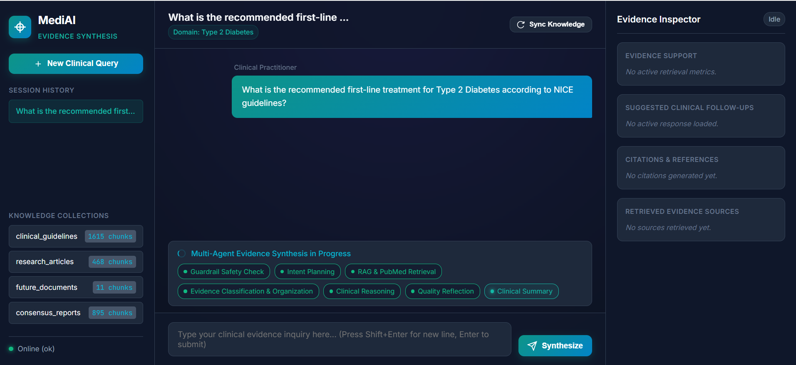

### 2. Real-Time Multi-Agent Execution Progress
During query synthesis, an interactive step timeline dynamically highlights the active agent (Guardrail Safety Check → Intent Planning → RAG & PubMed Retrieval → Evidence Classification → Clinical Reasoning → Reflection → Clinical Summary).

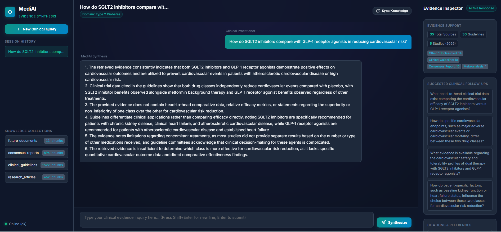

### 3. Synthesized Evidence & Grounded Citations Inspector
The generated synthesis presents concise, bulleted clinical recommendations paired with an Evidence Inspector panel detailing exact source guideline PDFs, study classifications, and page-level citations.

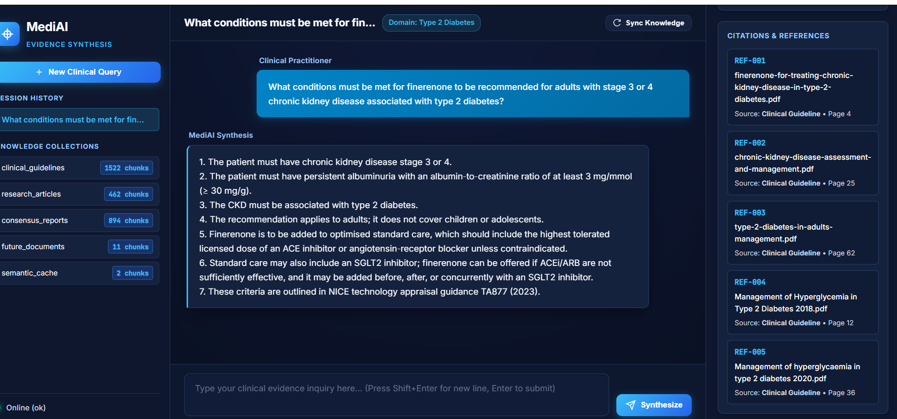

---

## 🏗️ Multi-Agent Architecture & Graph Nodes

The system utilizes a dual-tier execution pipeline:
1. **Semantic Caching Layer (Fast-Path)**: Evaluates incoming clinical queries using cosine vector similarity against previously verified syntheses in ChromaDB & Redis. If a query matches ($\ge 0.90$ similarity), the verified response is served immediately (~70ms), bypassing all LLM and external API calls.
2. **LangGraph Multi-Agent Workflow (Deep Synthesis)**: Orchestrated as a cyclic `StateGraph` separating **5 LLM-powered reasoning agents** (`app/agents/`) from **4 deterministic tools and processing nodes** (`app/nodes/`).

```
                              User Query
                                  │
                                  ▼
                   ┌──────────────────────────────┐
                   │   ⚡ Semantic Cache Lookup    │ ──hit (≥0.90 sim)──► Instant Response (~70ms)
                   │  (Chroma Vectors + Redis TTL)│
                   └──────────────┬───────────────┘
                                  │ (miss)
                                  ▼
                         [Guardrail Agent] ──blocked──► Safety Response
                                  │ (safe)
                                  ▼
                     ┌──────────────────────────┐
                     │   [Memory Node (load)]   │ ◄─── Fetches previous conversation turns,
                     │       (from Redis)       │      topics & citations using session_id
                     └────────────┬─────────────┘
                                  │ (enriched with conversation history)
                                  ▼
                         [Planner Agent] ◄─────────────────────────────────────┐
                                  │                                            │
                    ┌─────────────┴─────────────┐ (parallel fan-out)           │
                    ▼                           ▼                              │
         [Clinical Guideline RAG]        [PubMed Node]                         │
                 (Chroma)                 (NCBI Entrez)                        │
                    │                           │                              │
                    └─────────────┬─────────────┘                              │
                                  │                                            │
                                  ▼                                            │
                      [Evidence Ranking Node] (Deterministic metrics)          │
                                  │                                            │
                                  ▼                                            │
                      [Clinical Reasoning Agent]                               │
                                  │                                            │
                                  ▼                                            │
                         [Reflection Agent] ──retry (max 2) ───────────────────┘
                                  │ (sufficient evidence)
                                  ▼
                     [Clinical Summary Agent]
                                  │
                                  ▼
                     ┌──────────────────────────┐
                     │   [Memory Node (save)]   │ ───► Stores turn, summary & citations
                     │        (to Redis)        │      to Redis session memory
                     └────────────┬─────────────┘
                                  │
                                  ▼
                     ┌──────────────────────────┐
                     │  [Store Semantic Cache]  │ ───► Caches query embedding & response
                     │  (Chroma + Redis TTL)    │
                     └────────────┬─────────────┘
                                  │
                                  ▼
                        Clean Response & Citations
```

---

## 🤖 System Components (Agents & Deterministic Nodes)

### 🧠 Autonomous LLM Agents (`app/agents/`)
| Agent | Type | Responsibility |
|---|---|---|
| **Guardrail Agent** | LLM Agent | Detects unsafe, diagnostic, emergency, or prompt-injection requests and blocks them before entering the workflow. |
| **Planner Agent** | LLM Agent | Analyzes the clinical query, selects target collections, and determines retrieval routing strategies. |
| **Clinical Reasoning Agent** | LLM Agent | Interprets and compares classified evidence, identifies consensus and conflicts, while remaining strictly grounded in the provided evidence. |
| **Reflection Agent** | LLM Agent | Evaluates evidence sufficiency. If evidence is sparse or conflicting, triggers a retrieval retry cycle (maximum two iterations). |
| **Clinical Summary Agent** | LLM Agent | Generates the final clean natural-language response, structured citations (page numbers, PMIDs, DOIs), and follow-up questions. |

### ⚡ Deterministic Nodes & Tool Handlers (`app/nodes/`)
| Node / Module | Type | Responsibility |
|---|---|---|
| **Memory Node** | Tool / Redis | Loads and stores conversation history, tracked clinical topics, and evidence references using Redis without LLM overhead. |
| **Clinical Guideline RAG Node** | Tool / ChromaDB | Performs vector similarity search against local Chroma collections with exact page attribution. |
| **PubMed Node** | Tool / NCBI API | Queries NCBI Entrez REST API for biomedical literature, applies keyword filtering, and fetches article metadata. |
| **Evidence Ranking Node** | Deterministic Module | Deterministically classifies study types (Guideline, RCT, Meta-Analysis, Observational) and calculates objective metrics via metadata rules. |

---

## 🎯 Dynamic Agent Routing (Planner Agent)

The **Planner Agent** dynamically evaluates query intent and context to determine whether to search local guideline collections, query live PubMed biomedical literature, or execute both in parallel.

### 1. Guideline RAG Routing
When queries specifically target established clinical protocols, the Planner directs execution solely to the local ChromaDB guideline collection:

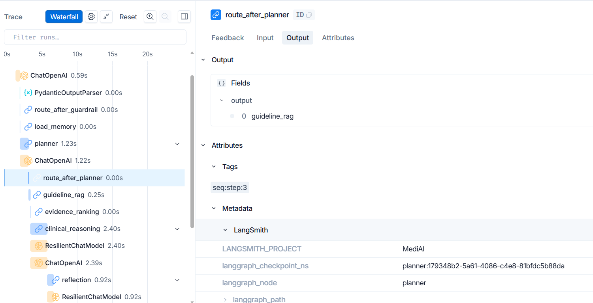

### 2. Parallel Guideline RAG + PubMed Literature Routing
For comparative or emerging clinical inquiries (e.g., comparing drug classes or novel trial findings), the Planner fans out retrieval in parallel to both ChromaDB Guidelines and the live NCBI PubMed API:

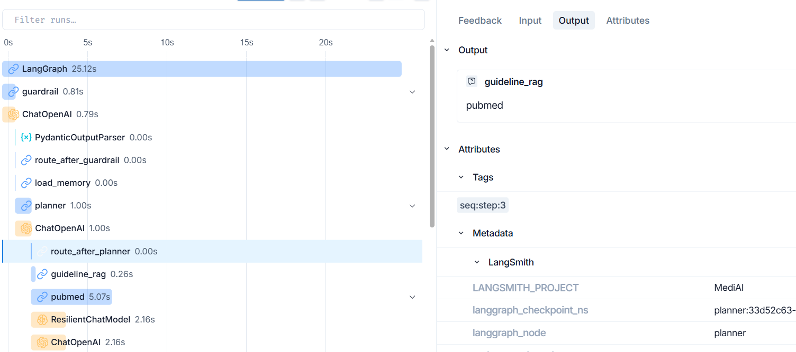

---

## 🔬 PubMed Search Tool Architecture

The PubMed integration uses a clean tool abstraction layer (`AbstractPubMedTool`) powered by the NCBI Entrez REST API (`EntrezPubMedTool`):

```
                         PubMed Agent
                               │
                               ▼
                   AbstractPubMedTool (Base)
                               │
                               ▼
                        EntrezPubMedTool
                      (NCBI Entrez REST API)
```

The node queries NCBI Entrez, extracts structured metadata (PMID, DOI, Journal, Authors, Publication Year, Abstract), and filters articles based on publication date and clinical study design:

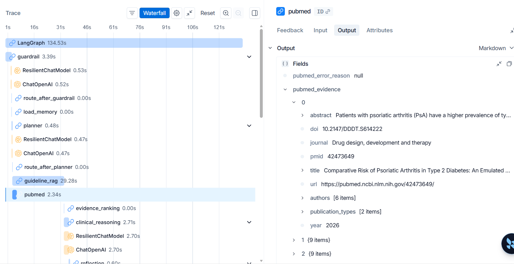

---

## 📄 Guideline RAG Evidence Attribution & Scoring

The **Clinical Guideline RAG Node** performs dense vector search over chunked clinical guidelines with precise page-level metadata tracking and similarity scoring:

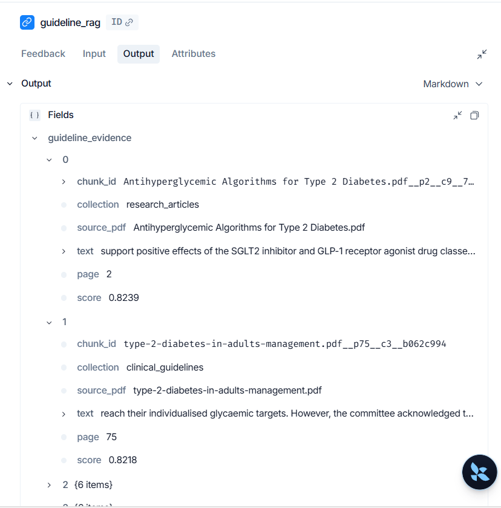

* **Source Tracking:** Each chunk is tagged with its source PDF, section header, collection name, and specific page number.
* **Similarity Thresholding:** Cosine distance scores are tracked to evaluate retrieval quality and filter out low-confidence context.

---

## 📂 Multi-Collection RAG Ingestion & Document Upload

Incremental ingestion automatically indexes new or modified clinical PDFs into ChromaDB collections without redundant chunking, while the upload endpoint enables interactive document ingestion directly from Swagger UI or client applications.

```
knowledge/
├── clinical_guidelines/    ← NICE Guidelines, ADA Standards of Care
├── consensus_reports/      ← ADA/EASD Consensus Reports
├── research_articles/      ← Peer-reviewed research papers & clinical trials
└── future_documents/       ← Reserved for future uploads (WHO, CDC, hospital SOPs)
```

### Document Upload & Targeted Ingestion (`POST /ingest/upload`)
Upload a single PDF document directly via multipart form-data (`UploadFile`) and instantly chunk, embed, and index it into the selected Chroma collection (`clinical_guidelines`, `consensus_reports`, `research_articles`, or `future_documents`).

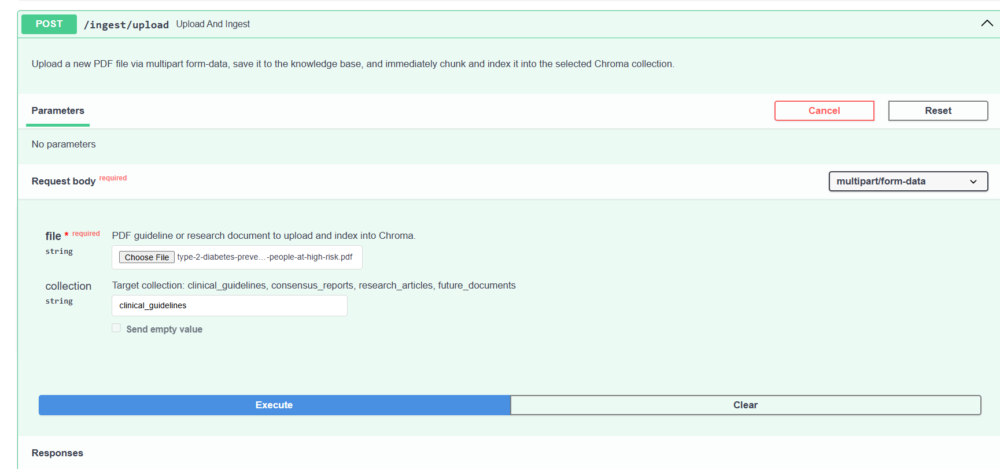

### Batch Rebuild & Knowledge Synchronization (`POST /ingest`)
Batch sync or rebuild Chroma collections from existing PDFs in the server's knowledge directory:
* **Default (`force=false`)**: Incremental sync — only processes new or modified PDFs on disk.
* **`force=true`**: For clean rebuilds if embedding models or chunk parameters are modified.

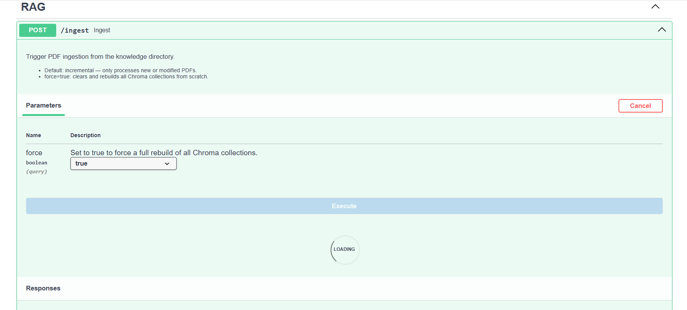

### Frontend Knowledge Status & Connection
The web interface dynamically polls and verifies backend connectivity and indexed collection status upon initialization:

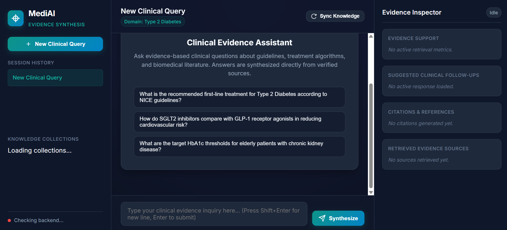

---

## 🔁 Reflection & Self-Correction Loop

When retrieved evidence is sparse, low-scoring, or conflicting, the **Reflection Agent** evaluates evidence completeness and triggers an automated query expansion loop (up to 2 iterations) before synthesis:

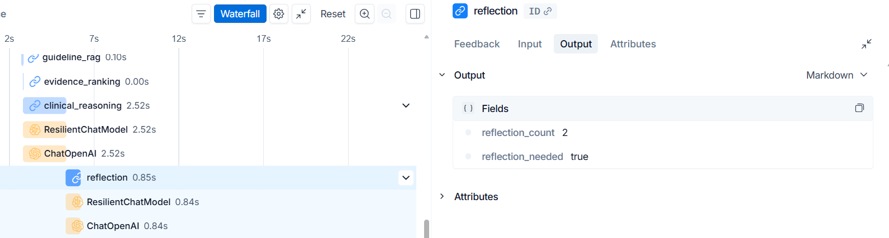

---

## 💾 Redis Session Memory & Multi-Turn Context

Persists session context across multi-turn clinical conversations, allowing clinicians to ask follow-up questions seamlessly while maintaining evidence tracking.

* **Memory Load Node (`app/nodes/load_memory.py`):** Placed immediately after the Guardrail check and *before* the Planner Agent. When a clinician asks a contextual follow-up (e.g., *"What specific contraindications or cautions exist for using it?"*), this node loads the previous turn's clinical topic (e.g., *"Finerenone"*), enabling the Planner to formulate accurate search queries.
* **Memory Save Node (`app/nodes/save_memory.py`):** Placed after the Clinical Summary Agent to persist the synthesized summary, updated topic, and deduplicated citation references for the session.

### Multi-Turn Conversational Follow-up in Web UI
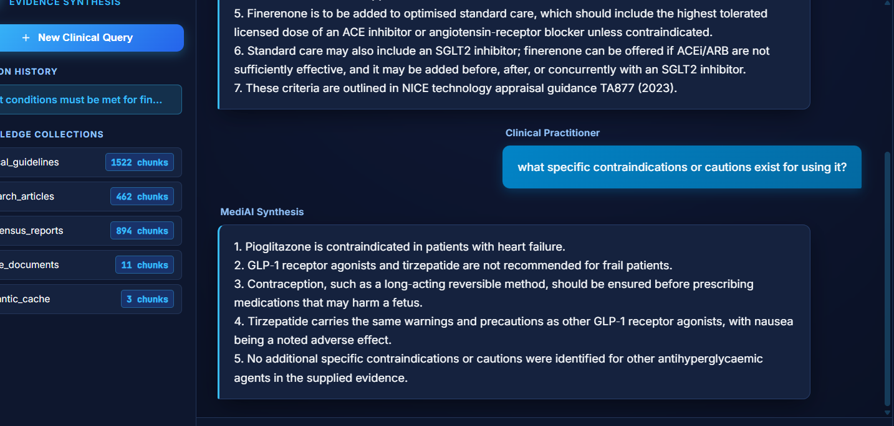

### Memory Context Injection Trace (LangSmith)
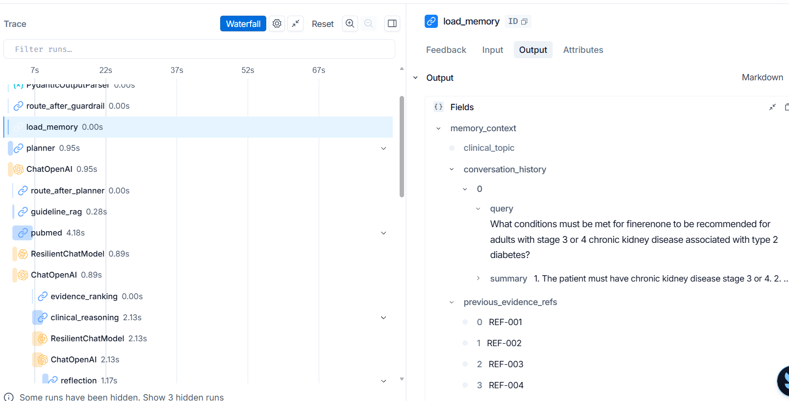

---

## ⚡ Vector Semantic Caching (Fast-Path)

To reduce redundant multi-agent pipeline executions and avoid PubMed API rate-limiting on common clinical inquiries, MedEvidence AI features an integrated **Semantic Cache**: 
*Note: Caching is generally not recommended for medical applications due to the sensitivity and dynamic nature of medical information. It is implemented in this project solely for learning and demonstration purposes.*

```
                       Incoming User Query
                               │
                               ▼
                    [embed_query(query)] (Sentence Transformers)
                               │
                               ▼
               [ChromaDB Collection: semantic_cache]
                               │
              ┌────────────────┴────────────────┐
              ▼                                 ▼
       Cosine Sim ≥ 0.90                 Cosine Sim < 0.90
         (Cache HIT)                       (Cache MISS)
              │                                 │
              ▼                                 ▼
   [Fetch Payload from Redis]       [Run LangGraph Multi-Agent Pipeline]
   (or In-Memory Fallback)                      │
              │                                 ▼
              │                     [Store Embedding in Chroma]
              │                     [Store Payload in Redis (TTL)]
              └────────────────┬────────────────┘
                               │
                               ▼
                       Return ChatResponse
                   (⚡ Badge in UI + Sim %)
```

* **Vector Lookup:** Nearest-neighbor cosine search in ChromaDB (`semantic_cache` collection).
* **Payload Store:** Full structured responses (`ClinicalSummaryResponse`, `SafetyResponse`, citations, evidence support) stored in Redis with configurable TTL (default 24h) and in-memory fallback.
* **Clinical Safety Threshold:** Defaults to `0.90` (can be tuned up to `0.95+` in `.env` for strict medical precision).
* **Management Endpoints:**
  * `GET /cache/stats` — View cache hits, misses, hit rate, and indexed vector counts.
  * `POST /cache/clear` — Clear vector entries and Redis cache keys.

### Semantic Cache Fast-Path Hit in Web UI
When a semantic cache hit occurs, the response is served instantaneously with a visual badge and similarity percentage:

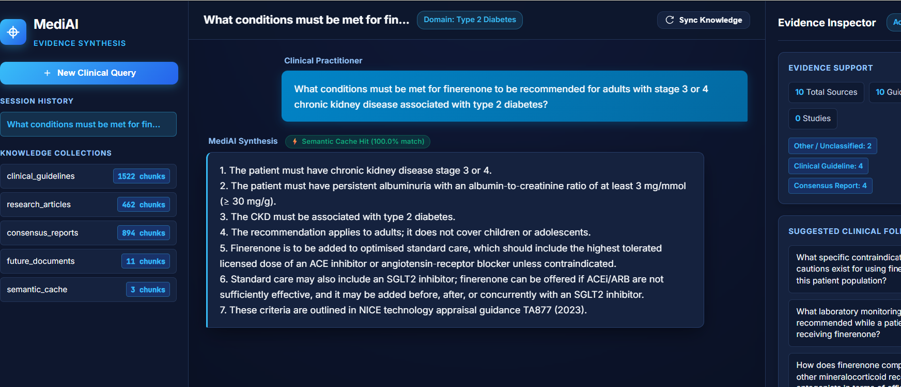

### Semantic Cache Fast-Path Trace (LangSmith)
When a cached query is matched, the semantic cache short-circuits the entire multi-agent graph, returning the verified synthesis in **~70ms** (0.07s) as traced in LangSmith:


---

## 🛡️ Clinical Guardrails & Safety Gate (Fail-Closed Pattern)

The **Guardrail Agent** implements a strict *Fail-Closed* architecture. It distinguishes between evidence-based guideline queries (allowed) and personalized diagnostic/patient treatment requests (blocked):

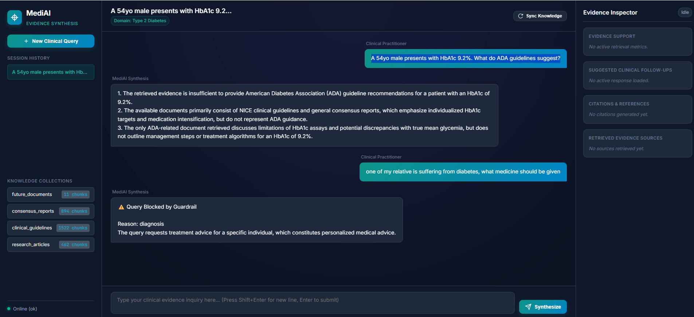

> **Clinical Safety Design (Fail-Closed Pattern):**  
> The system strictly disallows direct personalized medical diagnosis or treatment advice for specific patient cases. If an evaluation error, timeout, or network glitch occurs during safety evaluation, the query is safely blocked rather than bypassing safety checks.

---

## 📊 LangSmith End-to-End Observability & Latency Profiling

Full end-to-end trajectory tracing provides complete transparency across all LLM prompts, tool invocations, token counts, and step latencies:

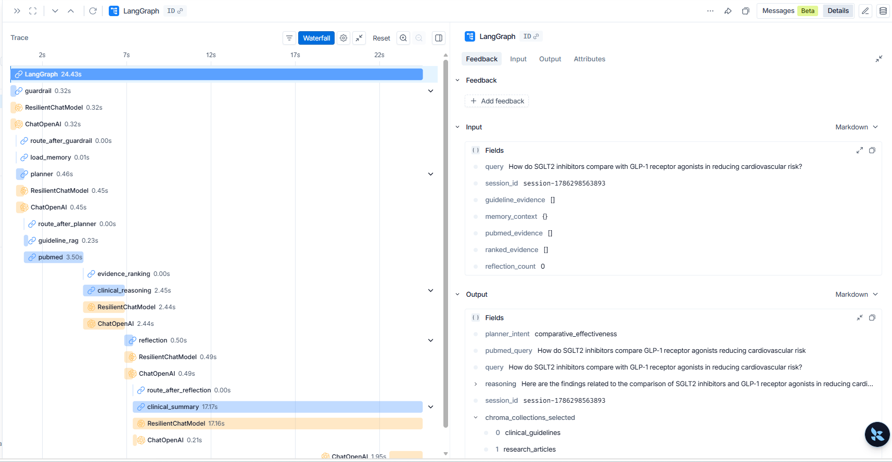

### ⏱️ Latency Breakdown & Bottleneck Analysis (for 1 trace)

End-to-end execution latency across the multi-agent pipeline typically ranges from **20s to 75s** depending on query complexity, the number of retrieved evidence chunks, and reflection retry loops. 

| Pipeline Stage / Node | Type | Typical Duration | Bottleneck Assessment |
|---|---|:---:|---|
| **Semantic Cache (Hit)** | ChromaDB + Redis | **~70ms** | ⚡ Instant fast-path bypass |
| **Guardrail Agent** | LLM (Safety Check) | **0.3s – 0.8s** | Negligible overhead |
| **Memory Load & Save** | Redis State | **< 0.05s** | Negligible overhead |
| **Planner Agent** | LLM (Routing & Strategy) | **0.5s – 1.2s** | Fast routing decisions |
| **Guideline RAG Node** | ChromaDB Vector Search | **0.1s – 0.3s** | Ultra-fast dense vector retrieval |
| **PubMed Node** | NCBI Entrez REST API | **2.0s – 5.0s** | Modest external network latency |
| **Evidence Ranking Node** | Deterministic Module | **< 0.01s** | Instantaneous computation |
| **Clinical Reasoning Agent** | LLM Multi-Doc Reasoning | **5.0s – 25.0s** | 🔴 **Major Bottleneck** (evidence cross-analysis & synthesis) |
| **Reflection Agent** | LLM Quality Evaluation | **0.8s – 2.0s** | Fast self-evaluation (triggers retry cycle if evidence sparse) |
| **Clinical Summary Agent** | LLM Synthesis & Citations | **12.0s – 40.0s** | 🔴 **Major Bottleneck** (comprehensive summary + citation formatting) |

> **Key Takeaway:** The system latency bottleneck is clearly **LLM reasoning and summarization (`clinical_reasoning` and `clinical_summary`)** rather than retrieval. Local ChromaDB guideline retrieval (~0.2s) and PubMed API fetching (~2–4s) constitute only a small fraction of the total execution time, while multi-agent LLM reasoning and structured citation generation account for over 80–90% of total response duration.

---

## 📈 RAGAS Performance Evaluation & Benchmarking

MedEvidence AI incorporates automated quantitative evaluation using **RAGAS** across a seed benchmark dataset combining both **live PubMed API** research articles and **local ChromaDB clinical guidelines**:

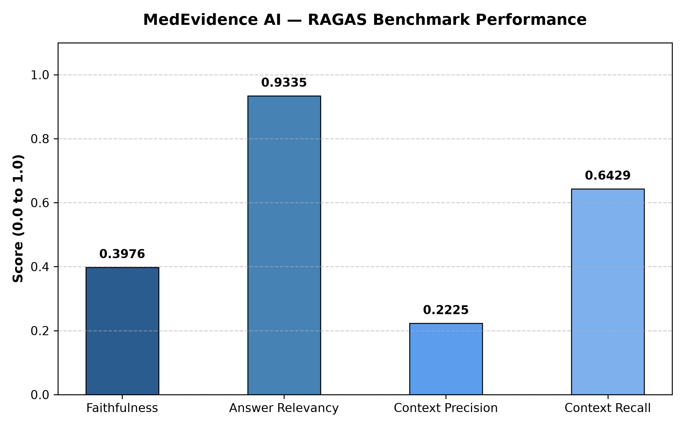

### RAGAS Metric Performance Breakdown
| Metric | Score | Industry Benchmark | Clinical Significance |
|---|:---:|:---:|---|
| **Answer Relevancy** | **0.9335** (93.4%) | $\ge 0.80$ | **Exceptional Directness**: Synthesized clinical responses align precisely with user queries with minimal filler. |
| **Context Recall** | **0.6429** (64.3%) | $\ge 0.80$ | **Retrieval Completeness**: 64.3% of essential clinical facts retrieved via BAAI/bge-small-en-v1.5 from ChromaDB + PubMed. |
| **Faithfulness** | **0.3976** (39.8%) | $\ge 0.85$ | **Groundedness**: Evaluates claim-level grounding against strict retrieved context chunks. |
| **Context Precision** | **0.2225** (22.3%) | $\ge 0.70$ | **Rank Precision**: Proportion of top-ranked context chunks directly relevant to ground truth. | 

*Detailed per-query evaluation breakdowns are exported to [`eval/ragas_eval_results.csv`](file:///c:/Users/Lenovo/MediAI_Langraph/eval/ragas_eval_results.csv).*

*Benchmark Dataset Reference:* [PubMedQA Dataset](https://huggingface.co/datasets/qiaojin/PubMedQA/viewer/pqa_artificial/train?q=type2+diabetes&row=14731)

### Running RAGAS Evaluation:
```bash
# Run automated benchmark evaluation in Docker
docker exec -it mediai_api python eval/evaluate_ragas.py
```

---

## ⚡ Performance Optimization & LLM Provider Setup

Because deep LLM reasoning and structured summarization (`clinical_reasoning` and `clinical_summary`) constitute the vast majority of the 20s–75s end-to-end pipeline latency, **high-throughput inference speed is critical**.

While local models via Ollama are supported for offline privacy, **inference latency is dramatically lower with Groq** using modern high-speed models such as `openai/gpt-oss-120b`, `openai/gpt-oss-20b`, or `llama-3.3-70b-versatile`. Fast cloud inference significantly compresses reasoning duration and makes the multi-agent system much more responsive.

To configure Groq, edit `.env`:

```env
LLM_PROVIDER=groq
LLM_MODEL=openai/gpt-oss-120b
GROQ_API_KEY=your_groq_api_key
```

> **Note on Model Availability:** Cloud providers periodically deprecate or rename model endpoints. If you encounter a `404 model_not_found` error, verify active models on the provider console (e.g., [Groq Models Console](https://console.groq.com/docs/models)) and update `LLM_MODEL` in your `.env`.

---

## 🚀 Quick Start

### 1. Configure Environment

```bash
cp .env.example .env
```

Set your preferred LLM provider:

```env
LLM_PROVIDER=groq
LLM_MODEL=llama-3.3-70b-versatile
GROQ_API_KEY=your_groq_api_key

PUBMED_EMAIL=your_email@example.com
```

### 2. Run with Docker Compose

```bash
docker compose -f docker/docker-compose.yml up --build
```

Services started:
* **Web UI**: [http://localhost:8000/ui/](http://localhost:8000/ui/)
* **FastAPI Docs**: [http://localhost:8000/docs](http://localhost:8000/docs)
* **ChromaDB**: [http://localhost:8001](http://localhost:8001)
* **Redis**: `localhost:6379`

### 3. Run Locally

```bash
pip install -r requirements.txt

# Start Redis & Chroma (Docker)
cd docker && docker compose up redis chroma -d && cd ..

# Start API server
uvicorn app.main:app --reload --host 0.0.0.0 --port 8000
```

---

## 💻 Tech Stack

| Layer | Technology |
|---|---|
| **Language** | Python 3.11+ |
| **Agent Orchestration** | LangGraph |
| **LLM Providers** | Groq (openai/gpt-oss-20b , openai/gpt-oss-120b ) / OpenAI / Gemini / Ollama |
| **Vector Store** | ChromaDB (Multi-collection, persistent) |
| **Embeddings** | Sentence Transformers (`BAAI/bge-small-en-v1.5`) |
| **Semantic Caching** | ChromaDB (Vector index) + Redis (Payload TTL Store) |
| **Session Memory** | Redis (Multi-turn conversational state) |
| **Biomedical Literature** | NCBI Entrez API |
| **Evaluation & Benchmarking** | RAGAS (Retrieval-Augmented Generation Assessment) |
| **API Framework** | FastAPI & Uvicorn |
| **Observability** | LangSmith |
| **Frontend UI** | HTML5 / Vanilla CSS / JavaScript |
| **Containers** | Docker Compose |

---

## 🔮 Future Roadmap

* **Latency Reduction**: Async streaming of agent thoughts and incremental token delivery.
* **Additional Domains**: Pre-configured knowledge collections for Cardiology, Oncology, and Nephrology.
* **Cloud Deployment**: Helm charts and Terraform templates for AWS/GCP Kubernetes deployment.
